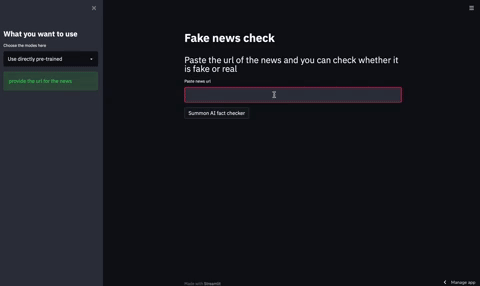

# urlcheck

# Streamlit app to check whether certain news is fake or real using Machine Learning models

*Just click to Open in Streamlit icon and it should be all good to run :)*

====================================================================================

#### I used multiple featurizers to classify fake vs real news

Approaches are:

1. Domain name and keyword featurizer:

    - This is like searching domain names of the websites and counting certain keywords

2. Bag of Words featurizer:

    - Using one-hot-encoding method to encode website's description 
        - weaknesses: doesn't capture the word similarity and doesn't care about word order

3. Word Embeddings using GloVe:

    - Basically, creating word vectors for each word based on reference model that has been trained on large dataset
    - Captures word similarities pretty well

Eventually, I combine all features from above 3 approaches and train simple Logistic Regression model using scikit-learn.

The Results are:
- Logistic Regression
    - Testing accuracy of 79.9% 
    - Precision: 72.3% | lots of False Positives: Real news sometimes classified as Fake, probably some smaller scale news channels look like fake news site
    - Recall: 90.8%  | doing pretty well on False Negatives: Not classifying fake news as real which is good, at least not helping with misinformation lol
- Neural Networks:
    - Testing accuracy: 83.5%
    - Precision: 76% | doing better in False Positives
    - Recall: 92.9% | Really good

Neural networks usually give better results, that is expected. However, most companies prefer more explainable model which is going to be Logistic Regression. Neural networks are hard to explain since, they don't learn about features, I would say, they just transform data representation to more abstract hyperplane.

===================================================================================

Current work ongoing on:

    - Giving possibility of training model from scratch by taking user specified hyperparemeters
    - Adding model selections, like neural networks, decision trees, random forest classifier

Future potential extension:

    - Training state-of-art model and making it chrome extension
    - Creating executable or apk/ios probably
